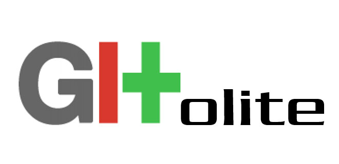

autoscale:true
theme: Next, 9

# Intro to GitLab
## DevOps on a Shell Script Budget


---

# Mac Justice

## Sr. Support Specialist
## Synapse Product Development

^ My name is Mac Justice, I'm the Senior Support Specialist at Synapse Product Development.

^ I think I've heard every joke there is about my name, but feel free to try.

---


^ Synapse is a engineering consulting company specializing in hardware development. We specialize in mechanical, electrical, and firmware engineering. Clients come to us with products they would like to create, and we help turn ideas into a manufacturable product.

^ Most of our client work is under NDA, but I can say a few folks here work for companies that are our customers.

---


^ The firmware developers I work with need a version control system, and since many work with embedded Linux they're very comfortable with git.

^ So, they looked into setting up a central git repo host.

---


^ First, Synapse used Gitolite, a free open source tool which gets the job done but with very few frills.

^ It has no GUI, so user interaction is strictly via ssh. It's pretty much just a git host with access control features.

---
# Git Host Wish List
- Web GUI
- Issue tracking
- Inexpensive

^ In 2012, as Synapse grew, we started to see a need for a more full featured repo host.

^ We wanted a nice web GUI, so our engineers and clients can share input and collaborate easily. It also helps us manage permissions and the like on the administrative side.

^ ctd next slide

---
# Git Host Wish List
- Web GUI
- Issue tracking
- Inexpensive

^ Some projects used JIRA for bug tracking, but it was expensive and cumbersome to manage for a small company with many short-term projects. An integrated issue tracker would be a plus.

^ Additionally, we wanted a tool that wouldn't cost us an arm and a leg. Again, Synapse is not a very big company, and software development is only part of our service offering.

---


^ After considering some alternatives, such as GitHub Enterprise and Atlassian's BitBucket/JIRA/Bamboo stack, we settled on GitLab, largely because it was free and easy to set up.

^ The employee doing the selection was also a Ruby guy, and GL is built on Rails.

^ Not the most rigorous of selection criteria, but the product has grown a lot in the 5 years we've been using it, and it's been a big win for us.

---
# [fit] GitLab Administration

^ So let's talk really quick about what it takes to run your own GitLab server.

---
# GitLab Administration
## Self Hosted Tiers

Edition | Price | Support | Features
---|---|---|---
Community | Free | Nope | All major functionality
Enterprise Starter | $40/user/year | Next Day | More permissions controls
Enterprise Premium | $200/user/year | 4 Hour | High Availability, other advanced features

^ GitLab has tiered editions for the self-hosted product. We used Community Edition until just this past year when we decided support and a few of the more advanced features were worth it to us, but 95% of what we use GitLab for is in CE.

---
# GitLab Administration
## Easy Set Up

- "Omnibus" package for Linux
- Docker Container
- Pre-built VMs (Amazon EC2/LightSail, Digital Ocean)

^ At Synapse we host GitLab on an Ubuntu VM in our VMware cluster.

^ Reccomend trying AWS or Digital Ocean if you want a running GitLab instance set up in just a minute or two.

^ GitLab releases feature updates every month, and several patchs in between those. It's very actively developed.

---
# GitLab Administration
## Authentication & Authorization
- Built-in
- LDAP
- OAuth & SAML

^ There are a ton of methods to enable you and your users to log in to your GitLab. You can mix and match. At Synapse, we use G Suite SAML for employee login, cross-referenced with LDAP for group permissions. Synapse customers use Google Oauth via the OmniAuth feature.

---
# GitLab Administration
## Integrations


^ GitLab is extremely integration friendly. It has prebuilt notification services for the major team chat services, including Slack slash commands. It has a handy RESTful API, as well as customizable webhooks to interact with other services.

---


<!--  -->

^ By this time you might be thinking, OK, I've seen server applications get installed and have users and all that. What's cool about GitLab?

---
# [fit] Git LFS

^ In 2015, GitLab announced Git LFS, or Large File Storage.

---
#[fit]Git +  = :cold_sweat:

^ Because Git is designed for text files, it's not great at managing binary files, especially large ones.

---
#[fit]Git LFS +  = :heart_eyes:

^ A few tools have been created to address this. GitHub created Git LFS to make it easy, and it's supported by major Git server products like GitHub, GitLab, and BitBucket.

^ Git LFS works by using pointer files to indicate changes to large files while leaving all but the currently checked out version on the central server.

---
#[fit]Git LFS +  = :heart_eyes:

##(LFS = Large File Storage)

^ Enabling it in a GitLab project is as simple as clicking a checkbox and making sure you have sufficient space on your server. You can limit how much space each project has for LFS storage.

^ Git LFS can handle pretty big files. The biggest I've had cause to use was a 7.7GB El Capitan AutoDMG image, which was no trouble at all.

---
# Git LFS Example
## Local Installation
```bash
brew install git-lfs
git lfs install
```

^ Installing git lfs is easy. It's available on brew and MacPorts, or you can download the binary from GitHub.

^ Git LFS install adds lfs support to your global git config.

---
# Git LFS Example
## Repo Setup
```bash
cd munki-repo
git lfs track "*.pkg"
git add .gitattributes
git commit -m "Added LFS tracking for PKGs"
```

^ Now that LFS is installed, you can just go to a repo and tell it which files to track. The pattern is added to .gitattributes, and once you commit that change you're in business.

---
# Git LFS Example
## There's no step 3!
```bash
git add pkgs/SweetApp.pkg
git commit -m "Added SweetApp"
git push origin master
```

^ Now you can interact with package files like you would any other file in git. Obviously you don't get granular diffs, but you now have a record and a copy of which pkg file you were working with at any given point in time.

^ From here it's as easy as using standard git push and pull commands to move packages to and from your git host.

---
# [fit] GitLab CI

^ Now the real fun starts.

---
# What is CI?
## Continuous Integration

1. Push code to GitLab ⌨️ ⬆️
2. Do something with that code ⚙️  🛠
3. Report results 🚫 ✅

<!-- ## Continuous Deployment
- Push code to GitLab :arrow_right: Build, Test :arrow_right: Deploy :arrow_right: :no_entry: :white_check_mark: -->

^ CI stands for Continuous Integration. If you've ever used Jenkins, you might have encountered CI. In the software development world, CI means every time you push updated code to your project, it's automatically built or tested, to reduce the likelihood of bugs cropping up. If you know the old carpentry saying "measure twice, cut once", imagine if you could automatically check your measurement each time you move the saw.

---
# CI Runners


^ GitLab has a client they call the GitLab CI runner. You can run it on each of the major OSes.

^ Once you have the runner installed, it will wait for GitLab to assign it jobs. Jobs can be run in sequence or parallel, and can be anything you can script.

^ Runners can be shared by many GitLab projects, or you can create runners reserved for specific projects, if a specific environment is needed.

^ Sponsor shout out, Robert and Gregory from MacStadium, GL blog post

---
# CI Runners


^ GitLab CI even supports Docker, so you even create temporary containers that execute the job, return the result, and are discarded. You can pull containers from the Docker Hub or another registry, and GitLab has a built-in registry too.

---
# CI Autoscaling Mode

^ The GitLab runner also has an "autoscale" mode, which uses the Docker Machine tool to create temporary VMs in a cloud provider like AWS or Digital Ocean. The VMs execute their assigned jobs, return the results, and are terminated and deleted.

---
# CI Configuration
## .gitlab-ci.yml
```yaml
validate:
  stage: test
  script: lint_roller.sh

roll_out:
  stage: deploy
  only: master
  script:
    - ./sound_klaxons_and_flash_lights.py
    - rsync build/* user@remote_server:/deploy/path/
```

^ My favorite part about GitLab CI is that you define your CI jobs as code, so changes to your build process are tracked in git too.

^ Here's an example of a CI config file. You just add one of these to your repo, and GitLab will try to start executing CI for your project on an available runner. You can call scripts and commands, specify stage order, set variables, pass files between stages, and lots more.

---
# .gitlab-ci.yml, annotated
```yaml
validate: # first job name
  stage: test # All 'test' stage jobs run before 'deploy' stage
  script: lint_roller.sh # Run this script

deploy: # second job name
  stage: deploy # Start only when all 'test' stage jobs complete
  only: master # Only run on Master branch
  script:
    - ./sound_klaxons_and_flash_lights.py # Call script in repo
    - rsync build/* user@remote_server:/deploy/path/ # inline command
```

^ In this example, I have two jobs, validate and roll-out. Validate is in the test stage, so it goes first, and it just runs the "check for typos" script. It will run any time someone pushes a commit to the parent GitLab project.

^ The second job, Roll-out, is marked as a deploy stage, so it only starts when all test jobs complete successfully. I specify to only run this job when there are updates to the master branch, because I don't want to push development branches to production. Finally, it runs a script, and an inline command.

^ If both jobs succeed, GitLab CI reports success.

---
# [fit] So what about Macs?

^ And here's the payoff. I would like to credit Tim Sutton for planting most of these ideas in my head with his Jenkins talk at last year's MacDevOps.

---


^ I'll start with everybody's favorite.

---
# Munki in Git

- History
- Collaboration
- Experimentation


^ If you use Munki, you're likely already familiar with the advantages of keeping your Munki repository in version control.

<!-- ^ If you're not already familiar with how Munki works, at its heart it's a set of plists, pkgs, and dmgs distributed that the Mac client app requests via http. Very simple technically, but there's a little learning curve to using it. -->

---
# The Old Way (No LFS, No CI)


^ Before I started using GitLab CI and Git LFS, my Munki workflow was an unwieldy amalgam of git, ssh, and rsync. It was a pain in the butt to get more than one person involved, you had to pull from git and rsync the packages from the Munki server and hope it was all in sync and hope nobody else would clobber your changes.

---
# The New Way


^ Deploying via GitLab is as simple as can be. I make my changes to my local repo, push it to GitLab, which then processes the changes and syncs them to the Munki servers, and clients start updating. Easy.

---


^ From an infrastructure point of view, Imagr is very similar to Munki. I moved our Imagr repo into an LFS enabled git repo, and configured the CI to trigger a sync on each of our site image servers when we push to the master, just like I did with Munki, and that was it.

---


^ Since the GitLab CI runner supports Mac OS, I set up a runner with an Apple developer certificate that signs all our configuration profiles. I also added a step to lint the plists and validate the contents of some fields, like PayloadOrganization. One time I slipped up and deployed a profile from "Your Org Here" to the whole company.

^ Next I want to figure out how to make the profiles get added to my Munki repo after being signed.

---
# 🚗 

---
# ? 🚗  ?

---


^ AutoPkg is another good use case for CI. I haven't implemented this in GitLab CI myself yet, but Rick Heil has. You put all your overrides in a repo together, and use a nifty script from Facebook CPE to commit updated applications to your Munki repo.

<!-- ---
# [fit]Demo

^ Open .gitlab-ci.yml and s3-deploy.sh. Walk through the yml, the deploy script, and show how variables are set in the GitLab project outside of version control that can be passed into CI

^ Launch Mac Client VM. Prestaged with Managed Software Center, [s3-auth](https://github.com/waderobson/s3-auth) middleware script and settings, S3 bucket with R/W IAM user for CI and Read-Only user for Munki.

^ Open munki-repo in Munki Admin. Add package to site_default manifest. Save.

^ `cd gitlab_presentation`
`git add .`
`git commit -m "added pkg"`
`git push`

^ open https://gitlab.synapse.com/macj/gitlab_presentation
hit "pipelines" section
Open the log for the CI build

^ Once complete, check for updates in the Managed Software Center in client VM.
GREAT SUCCESS -->

---
# [fit] So

^ So why do all this?

---
# [fit] Automatic

^ Using GitLab and CI makes it much easier to do better IT.

^ Automation is good, but the more you can control the execution environment, the more reliable it is. With GitLab CI, it's really easy. You set up your runner environment, and then just send your tasks to it.

---
# [fit] Accountable

^ You get to see exactly what changed, who changed it, and when. You get your git history, as well as the execution transcripts of every job sent to CI.

---
# [fit] Collaborative

^ "Hey, are you on the server?" Nobody likes that question. By routing our workflows through GitLab, anybody can jump in the process. If our work conflicts, we find out before it gets into production.


---

# More Information
- This presentation: gitlab.com/macjustice/gitlab-presentation
- [GitLab](www.gitlab.com)
- [GitLab CI](https://about.gitlab.com/gitlab-ci/)
- [Git LFS](https://git-lfs.github.com/)
- MacDevOps:YVR 2016
  - [Tim Sutton on Jenkins CI](http://macdevops.ca/MDO2016/jenkins/Default.html)
  - [Wade Robson on Munki & S3](http://matx.ca/mdoyvr/2016/day2/munkimiddleware/Default.html)

---
# Thanks!
### Twitter: @macjustice
### MacAdmins Slack: macjustice
### Wherever: macjustice

---
# Q & A
