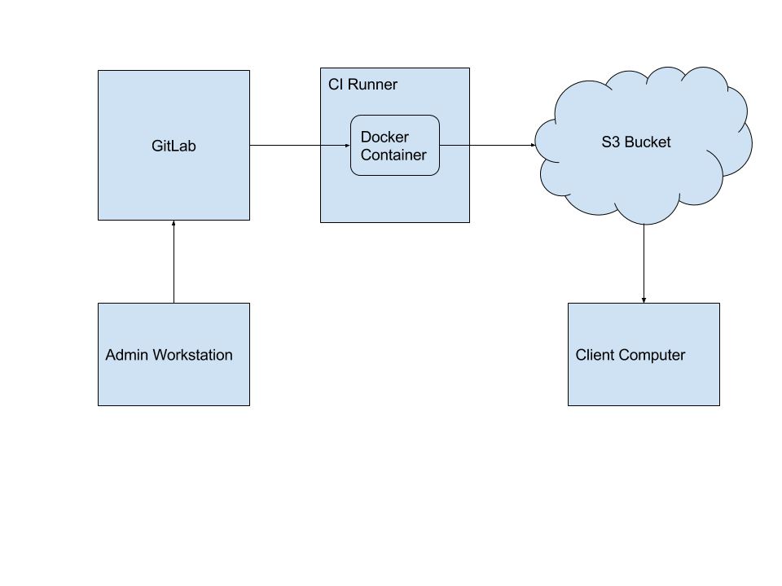

autoscale: true

# GitLab for Fun and Continuous Deployment

^ Welcome, and thanks everybody for coming out to this meeting of NorthWest Apple Admins. Before we get going, I'd like to thank Chris for organizing this, and to Mallory and Tableau for hosting.

---

# Mac Justice
## Senior Support Specialist
### Synapse Product Development

^ My name is Mac Justice, I'm the Senior Support Specialist at Synapse Product Development.


---


^ Synapse is a engineering consulting company specializing in product development. We primarily specialize in mechanical, electrical, and firmware engineering. Clients come to us with products they would like to bring to market, and we help turn ideas into a manufacturable product.

---
# [fit] The Tools

^ I'll start with an overview of the tools involved, then give you a demonstration of a workflow I use in production.

---
# [fit] Git


- Source Code Management
- Tracks changes to text files
- Designed for collaboration


^ Git is a popular source code management tool. If you work with text files like scripts or config files on a regular basis, start using it. It allows you to track changes and to make branches to your code so you can experiment and increment safely. In a team environment it also makes it easy for multiple people to work on the same project simultaneously.

---
#[fit]Git + Big Files = :cold_sweat:

^ Because Git is designed for text files, it chokes on big binary files such as packages or disk images.

---
#[fit]Git + Git LFS + Big Files = :heart_eyes:

###(LFS = Large File Storage)

^Tools like Git Annex and Git Fat have been developed to address this, but they're unwieldy and not widely supported. GitHub created Git LFS to make it easy, and it's supported by major Git server products like GitHub, GitLab, and BitBucket.

---
# Example
```bash
brew install git-lfs
cd munki-repo
git lfs install
git lfs track "*.dmg"

git add pkgs/GoogleChrome.dmg
git commit -m "Added Chrome"
git push origin master
```

^ A quick example. Install git-lfs, open an existing git repo, use `git lfs install` to initialize lfs in that repo, then specify the file types you would like to track. From here on, you can use standard git commands to stage files, commit your changes, then push them to a remote server, just like you would with a standard git repo.

---


#[fit]GitLab
- Open Source
- Self-hosted or gitlab.com
- Freemium: Free and paid editions


^ In our case, that remote server is GitLab. GitLab is an open source competitor to GitHub. It's very easy to set up, just a package install on most Linux distros. The free edition is good enough for most environments, including ours, the paid version adds some nice bonus features and support. GitLab has lots of cool features, like the already-mentioned Git LFS support, as well as an issue tracker, wiki hosting, a container registry, and more, but I'm gong to focus on my favorite feature...

---
# [fit] GitLab CI

---
# What is CI?

## Continuous Integration
- Push code :arrow_right: Build and Test :arrow_right: :no_entry: :white_check_mark:

## Continuous Deployment
- Push code :arrow_right: Build, Test, Deploy :arrow_right: :no_entry: :white_check_mark:

^ CI stands for Continuous Integration. In the software development world, this usually means your code is automatically tested and built every time you push it to the server, to reduce the likelihood of bugs cropping up. It has a sister concept, Continuous Deployment, which takes it one step further, using the same tools to then automatically put your code into production.

---
# CI Runners


^ CI copies your code to a runner client, which can run on Linux, Mac, or Windows; virtual or physical. There it executes one or more jobs. Jobs can be run in sequence or parallel, and can be anything you can script. GitLab CI even supports Docker, so you even create temporary containers that execute the job, return the result, and are discarded.

---
# .gitlab-ci.yml

```yaml
validate:
  stage: test
  script: check_for_typos.sh

roll_out:
  stage: deploy
  when: manual
  only: master
  script:
    - ./reticulate_splines.py
    - rsync build/* user@remote_server:/deploy/path/
```

^ My favorite part about GitLab CI is that the file that defines your CI jobs is included in your git repo, and so is tracked along with the rest of your files. You just add a file named `.gitlab-ci.yml` to your repo, and GitLab will try to start building your project. You can call out scripts, run inline commands, specify stage order, set variables, limit which runners should run the job, and lots more. So, lets take a look at a CI yml file.

---
# .gitlab-ci.yml, annotated

```yaml
validate: # first job name
  stage: test # All 'test' stage jobs run before 'deploy' stage
  script: check_for_typos.sh # Run this script

roll_out: # second job name
  stage: deploy # Start only when all 'test' stage jobs complete
  when: manual # Require user interaction to start
  only: master # Only run on Master branch
  script:
    - ./reticulate_splines.py # Call script in repo
    - rsync build/* user@remote_server:/deploy/path/ # inline command
```

^ In this example, I have two jobs, validate and roll-out. Validate is in the test stage, so it goes first, and it just runs the "check for typos" script. It will run any time someone pushes to GitLab.
Roll-out is marked as a deploy stage, so it starts when all test jobs complete. I've set `when` to manual, so roll-out won't start until I click go on the GitLab project page. I also specify to only run this job when there are updates to the master branch, because I don't want to push development branches to production. Finally, it runs a script, and an inline command. If everything suceeds, GitLab CI reports success.

---
# Result


^ As you can see in this screenshot, the build passed. The test step completed successfully, and the deploy step wasn't run because this wasn't the master branch. For illustration purposes I enabled the manual option for Deploy, which can be started in the menu to the right of the build.

---
# [fit] GitLab at Synapse

---
# GitLab at Synapse
## Client Work
- Easy (and free) to include clients :free:
- Issue tracker for feedback and milestone planning :bar_chart:
- Build and test environments are documented :no_good: :snowflake:
- Runner + physical computer = hardware testing! :computer::calling:

^ We started using GitLab at Synapse 3 years ago for our engineers to host their project repos. It's easy to add accounts for our clients to access the code we write for them, and to get visibility into project progress through the issue tracker and milestone planning. Doing testing using Gitlab CI means  build and test environments are better documented, resulting in fewer "snowflakes". Installing the runner client on physical computers also allows us to do automated hardware testing on connected devices.

---
# GitLab at Synapse
## IT
- Munki 
  - Automatic upload to S3 host
- Imagr :computer:
  - Automatic `rsync`ing to site imaging servers
- Ansible :satellite:
  - Configuration Management for Linux servers

^ In the IT department we try to store as much of our scripts and configurations in GitLab as we can. This includes Munki and Imagr, which using CI and LFS are automatically deployed whenever a commit to the master branch is made. We use Ansible for configuration management of our Linux servers, changes pushed to master are automatically deployed after review.

---
# Infrastructure


---
# [fit]Demo

^ Open .gitlab-ci.yml and s3-deploy.sh. Walk through the yml, the deploy script, and show how variables are set in the GitLab project outside of version control that can be passed into CI

^ Launch Mac Client VM. Prestaged with Managed Software Center, [s3-auth](https://github.com/waderobson/s3-auth) middleware script and settings, S3 bucket with R/W IAM user for CI and Read-Only user for Munki.

^ Open munki-repo in Munki Admin. Add package to site_default manifest. Save.

^ `cd gitlab_presentation`
`git add .`
`git commit -m "added pkg"`
`git push`

^ open https://gitlab.synapse.com/macj/gitlab_presentation
hit "pipelines" section
Open the log for the CI build

^ Once complete, check for updates in the Managed Software Center in client VM.
GREAT SUCCESS

---
# Q & A

---

# More Information
- This presentation: github.com/macjustice/gitlab-presentation
- [GitLab](www.gitlab.com)
- [GitLab CI](https://about.gitlab.com/gitlab-ci/)
- [Git LFS](https://git-lfs.github.com/)
- MacDevOps:YVR 2016
  - [Tim Sutton on Jenkins CI](http://macdevops.ca/MDO2016/jenkins/Default.html)
  - [Wade Robson on Munki & S3](http://matx.ca/mdoyvr/2016/day2/munkimiddleware/Default.html)

---
# Thanks!
### Twitter: @macjustice
### MacAdmins Slack: macjustice
### GitHub: macjustice
### Wherever: macjustice
